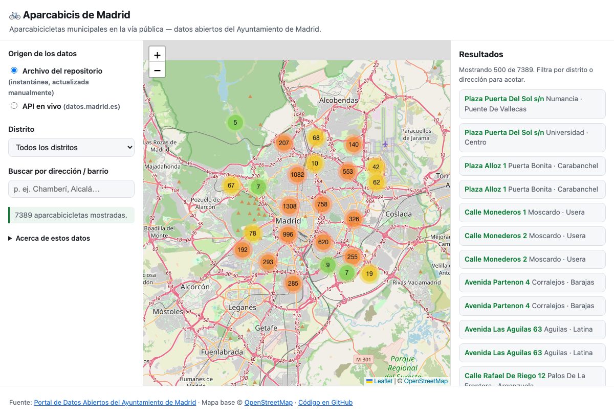

# 🚲 Aparcabicis de Madrid — mapa interactivo

Interactive map of Madrid's **municipal on-street bike-parking racks** (*aparcabicicletas*),
built on the city's open-data feed. Pure static site — no backend, no build step — so it can
be served straight from GitHub Pages.

**Live demo:** _add your GitHub Pages URL here after enabling Pages._



## Features

- Interactive Leaflet map with marker **clustering** (7 000+ points stay readable).
- **Two data sources, toggleable at runtime:**
  - **Repository file** — a snapshot committed to `data/`, refreshed manually.
  - **Live API** — queried directly from `datos.madrid.es` in the browser.
- Filter by **district** and free-text **search** (address / neighbourhood).
- Accessible companion **list** synced to the current filter, keyboard support, skip link,
  light/dark themes, responsive layout.
- Coordinates converted on the fly from **ETRS89 UTM zone 30N → WGS84** (the source data has
  no populated lat/lon), so both data sources render identically.

## Architecture

The simplest thing that works: three static files (`index.html`, `app.js`, `style.css`) plus a
data snapshot. Leaflet is loaded from a CDN. Everything runs client-side.

```
index.html            markup + CDN links
app.js                data loading, UTM→WGS84 conversion, map, filters
style.css             styling (light/dark, responsive, a11y)
data/aparcabicis.json committed snapshot (Madrid datastore dump, JSON)
scripts/update-data.sh reproducible data refresh
```

No server is required because the Madrid API sends `Access-Control-Allow-Origin: *`, so the
browser can fetch it cross-origin, and the whole dataset (~7 400 rows) comes back in a single
request.

## Which data-file format to commit? → **JSON**

The dataset is offered as CSV, JSON and XML. This project commits **JSON**, because:

| Format | Size   | Verdict |
| ------ | ------ | ------- |
| JSON   | ~1.8 MB | ✅ **Chosen.** Parsed natively by the browser with `JSON.parse`; same shape as the live API, so one code path handles both sources. |
| CSV    | ~1.3 MB | Smallest, but needs a CSV parser and is fragile around quoting and accented text. |
| XML    | ~5.5 MB | 3× larger and needs DOM parsing for no benefit. |

Since live mode already speaks JSON, using JSON for the file means the app has a **single
parser and a single rendering path** — the most robust, least surprising choice.

> Note: the file download and the API return slightly different JSON *shapes* — the dump uses
> `{fields, records: [[…]]}` (row arrays) while the API uses `{result: {records: [{…}]}}`
> (objects). `normalizeRecords()` in `app.js` accepts both.

## Updating the committed data

The snapshot is refreshed **manually** (the dataset changes infrequently):

```bash
./scripts/update-data.sh
git add data/aparcabicis.json
git commit -m "data: refresh snapshot"
git push
```

The script downloads the latest dump, validates it, and only then overwrites the file. You can
also download it by hand from the [dataset page](https://datos.madrid.es/dataset/205099-0-aparca-bicis)
(*Exportar → JSON*) and drop it in at `data/aparcabicis.json`.

## Run locally

Any static file server works (opening `index.html` via `file://` won't allow `fetch`):

```bash
python3 -m http.server 8000
# open http://localhost:8000
```

## Deploy

The site is any-host static, so it works on GitHub Pages, Cloudflare Pages, Netlify, etc.

**Cloudflare Pages (this project's deployment):**

1. Cloudflare dashboard → **Workers & Pages → Create → Pages → Connect to Git**.
2. Select the `madrid-bike-parking` repository.
3. Build settings — it's a plain static site, no build step:
   - **Framework preset:** None
   - **Build command:** _(leave empty)_
   - **Build output directory:** `/`
4. Deploy. Every push to `main` redeploys automatically. A `*.pages.dev` URL is issued,
   and a custom domain/subdomain can be attached later.

**GitHub Pages** (alternative): Settings → Pages → Deploy from branch `main`, folder `/ (root)`.
`.nojekyll` is included so Pages serves the files as-is. Note: on an account whose user site
(`<user>.github.io`) has a custom-domain `CNAME`, GitHub redirects all `github.io` project URLs
to that domain — use a per-repo custom domain or Cloudflare Pages instead.

## Data & licensing

- Data: [Portal de Datos Abiertos del Ayuntamiento de Madrid](https://datos.madrid.es/dataset/205099-0-aparca-bicis)
  (resource `205099-2-aparca-bicis`). Only on-street municipal racks are included — not those
  inside sports centres, cultural venues, or historic/forest parks.
- Basemap: © OpenStreetMap contributors.
- Code: MIT (see `LICENSE`).
